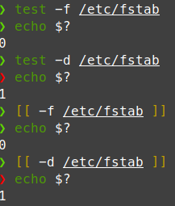

# Exit Codes

When you run a program in bash the program stores an exit code in `$?`

Example:
```bash
~$ printf "%v" "hello"
printf: %v: invalid directive
~$ echo $?
1
```

# Tests in Bash
To run a test in bash use `[[ ... ]]` or `test <FILE or Expression>`
 
 ### Options
 - `-e` test if file exist
 - `-f` test for a regular file
 - `-d` test for a directory
 - `-h or -L` test for symbolic link
  


## Conditional Execution 
The basic `if` command evaluates a list of one or more command

```bash
if <condition>
then 
    <list>
fi
```

## Looping
`**While**` loop 
```bash
while <list>
do
    <list>
done
```